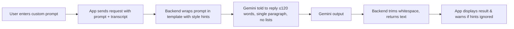
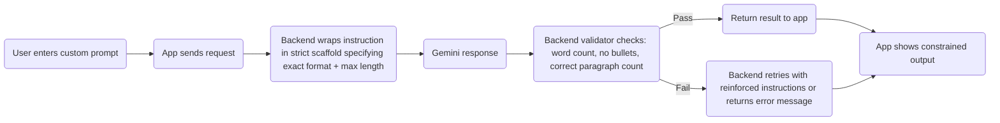

git # Custom Prompt Flows

This document visualizes the current custom prompt pipeline and two candidate constraint strategies. Each diagram is written in Mermaid so we can tweak or extend it easily.

---

## 1. Current Flow (Unconstrained)

**Characteristics**
- Gemini sees the raw user instruction with no extra guardrails.
- Output may include commentary, lists, or long text.
- No validation beyond “request succeeded.”

---

## 2. Soft Constraint Template

**What changes**
- Backend injects strong guidance (length, no lists, paragraph focus) before the user instruction.
- We do not reject responses; the app only surfaces warnings if the hints are ignored.

---

## 3. Hard Constraint Template + Validation

**What changes**
- Backend enforces a fixed structure (e.g., ≤120 words, single paragraph).  
- If the model’s answer violates rules, we either retry with extra instructions or respond with an error telling the user to adjust the prompt.
- Guarantees predictable formatting but adds latency and possible failures.

---

Use these diagrams to pick the enforcement level you want before we modify the `/api/transform` logic.

